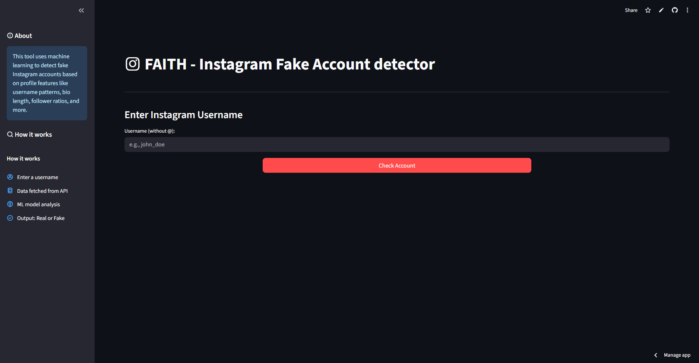
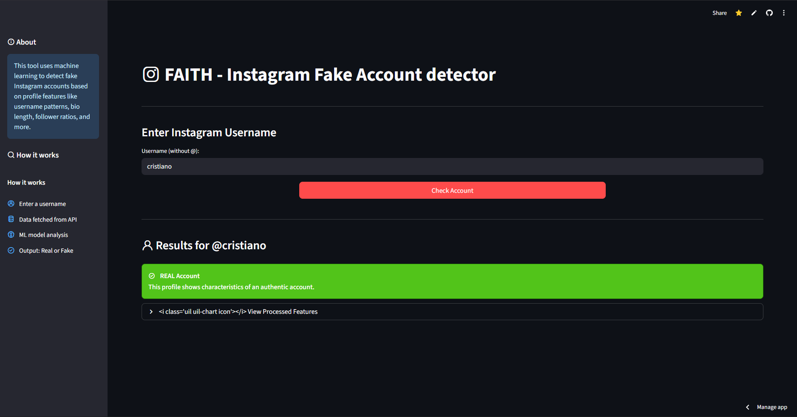

# FAITH – Fake Account Detector  

FAITH is a web application designed to detect fake accounts on social media platforms.  
This tool uses machine learning algorithms to analyze user profiles and identify potential fraudulent activity.  
With the rise of fake profiles used for misinformation, scams, and other malicious purposes, FAITH helps users and platforms ensure the authenticity of user accounts.

---

## 🚀 Live Demo  
👉 [Try FAITH Live](https://faith-detector.streamlit.app/)  

---

## 📸 Screenshots  

### Homepage  
  

### Prediction Example  
  

*(Place your screenshots inside an `assets/` folder in the repo and adjust the paths if needed.)*

---

## ✨ Features  
- **Profile Analysis**: Reviews user data such as profile completeness, activity patterns, and engagement behavior.  
- **Machine Learning Models**: Employs advanced ML algorithms to classify accounts as real or fake.  
- **User-friendly Interface**: A simple and intuitive interface for easy interaction and profile checking.  
- **Real-time Detection**: Provides instant analysis results for each user profile.  

---

## 🛠️ Technology Stack  
- **Frontend**: Streamlit (with custom CSS, Unicons)  
- **Backend**: Python (scikit-learn, pandas, joblib)  
- **Database**: MongoDB (future extension)  
- **Webscraper**: Apify  
- **Version Control**: Git & GitHub  

---

## ⚡ Usage  

1. Open the live app at: [https://faith-detector.streamlit.app/](https://faith-detector.streamlit.app/)  
   *(or run locally with `streamlit run proj/streamlit_app.py`)*  
2. Enter an Instagram username (without @).  
3. The system fetches profile data.  
4. The ML model analyzes features and predicts **Real** or **Fake**.  

---

## 🔮 Future Improvements  
- Integration with more social media platforms.  
- Enhanced model accuracy with additional features.  
- Real-time API support for large-scale detection.  

---
